# Evaluating Robustness and Resilience in Multi-Agent Reinforcement Learning

The Adversarial Multi-Agent Reinforcement Learning Benchmark (AMB) is a comprehensive framework for evaluating the robustness, resilience, and cooperation of MARL algorithms under adversarial and uncertain conditions. It provides a unified platform for benchmarking across diverse environments, uncertainties, and implementation choices, enabling large-scale empirical studies and the identification of best practices for trustworthy MARL.

In the paper "Evaluating Robustness and Resilience in Multi-Agent Reinforcement Learning," AMB is used as the core experimental platform. The study involves over 82,620 experiments across four real-world environments, 13 types of uncertainties, and 15 implementation choices, aiming to understand how these factors influence the robustness and resilience of MARL algorithms.

AMB integrates environments like Dexterous Hand Manipulation, Quadrotor Swarm Control, Intelligent Traffic Control, and Active Voltage Control, reflecting real-world complexities. It supports algorithms such as MADDPG, MAPPO, and HAPPO, and incorporates uncertainties like observation noise and action perturbations to thoroughly test algorithm robustness.

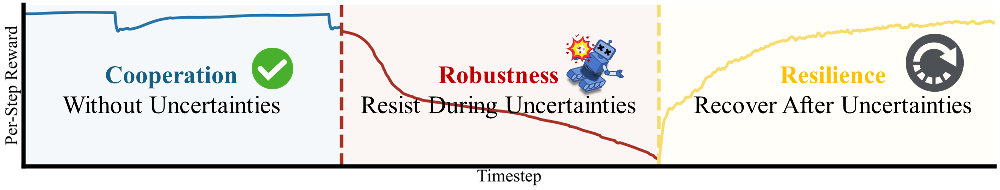

## Quick Start

This section provides a quick guide on how to get started with the Adversarial MARL Benchmark (AMB) framework. It covers the basic steps for setting up the environment, running experiments, and understanding the code architecture.

### Step 0: Setup Environment

Before you begin, ensure you have the necessary dependencies installed. Follow the instructions in the [Installation](#Installation) section to set up the conda environment and install environment-specific dependencies.

### Step 1: Configuration

Before starting the experiments, configure the default settings and tricks for each experiment group in the `settings` directory. This step is crucial as it defines the baseline parameters and the variations (tricks) to be tested.

- **Default Configuration**: Define the base parameters for each environment, scenario, and algorithm combination in the `settings/<env>/<scenario>_<algo>.json` files.
- **Tricks Configuration**: Define the parameter variations (tricks) to be tested in `settings/tricks.json`. Each trick modifies one or more parameters from the default configuration.

```
Example: Edit default settings for an experiment group
Edit settings/dexhands/ShadowHandPushBlock_maddpg.json

Example: Edit tricks configuration
Edit settings/tricks.json
```

### Step 2: Train Individual Algorithms

Before launching attacks on agents, training must be conducted first.

```bash
python -u single_train.py --env <env_name> --algo <algo_name> --exp_name <exp_name> --run single
```

Once the model is trained, it will be stored in the corresponding location. The model can then be loaded for subsequent attacks without the need for retraining, regardless of the type of attack algorithm used.

### Step 3: Train Attack Algorithms

After obtaining the trained model, you can proceed to train the attack algorithms.

We support a total of 13 attack algorithms, as detailed below:

| Attack Algorithm Key | Description in the Paper                                     |
| -------------------- | ------------------------------------------------------------ |
| `random_noise`       | Observation uncertainty: Gaussian noise applied to all agents (Gaussian-single). |
| `random_noise_all`   | Observation uncertainty: Gaussian noise applied to a single agent (Gaussian-all). |
| `pert_obs_sin`       | Observation uncertainty: Greedy worst-case attacks applied to a single agent (Greedy-single). |
| `pert_obs_all`       | Observation uncertainty: Greedy worst-case attacks applied to all agents (Greedy-all). |
| `learn_obs_sin`      | Observation uncertainty: Optimal learned attacks applied to a single agent (Optimal-single). |
| `learn_obs_all`      | Observation uncertainty: Optimal learned attacks applied to all agents (Optimal-all). |
| `env_random`         | Environment uncertainty: Randomized environment parameters affecting all agents (Env-random). |
| `random_policy`      | Action uncertainty: Random policies applied to a single agent (Random-single). |
| `random_policy_all`  | Action uncertainty: Random policies applied to all agents (Random-all). |
| `pert_act`           | Action uncertainty: Greedy worst-case policies applied to a single agent (Greedy-single). |
| `pert_act_all`       | Action uncertainty: Greedy worst-case policies applied to all agents (Greedy-all). |
| `learn_act`          | Action uncertainty: Optimal learned policies applied to a single agent (Optimal-single). |
| `learn_act_all`      | Action uncertainty: Optimal learned policies applied to all agents (Optimal-all). |

To generate the corresponding commands, you need to specify the appropriate parameters in `single_train.py` and load the model to achieve the desired attack effect.

```bash
python -u single_train.py \ 
  --env <env_name> --env.task <env_task_name> --algo <algo_name> \
  --algo.log_dir ./results --exp_name <exp_name> \
  --algo.use_eval <use_eval> \
  --algo.slice_eval <whether to slice eval> \
  --load_victim ./results/<env_name>/<env_task_name>/single/<algo_name>/default/<last_seed> \
  --run <attack_method> \
  <attack_conf>
```

- Replace `<attack_conf>` with the corresponding attack configuration from `ATTACK_CONF` for the attack algorithm you wish to execute.
- For attacks that require training in Stage 1, set `use_eval` to `False`. For others, set it to `True` to evaluate the attack effects. The attacks that require training are `"adaptive_action", "traitor", "learn_act", "learn_obs_all", "learn_obs_sin", "learn_act_all"`.
- For attacks that require training, set `num_env_steps` to `5000000` to train the attack effects. For others, set it to `0`.

All attack configurations are as follows:

```python
ATTACK_CONF = {
    ########## OBSERVATION UNCERTAINTY ##########
    # Observation uncertainty: Greedy-single
    "pert_obs_sin": "--run perturbation --algo.num_env_steps 0  --algo.perturb_iters 10 --algo.adaptive_alpha True --algo.targeted_attack False --adv_all False --adv_eps 0.1 --use_mad_perform True",
     # Observation uncertainty: Greedy-all
    "pert_obs_all": "--run perturbation --algo.num_env_steps 0  --algo.perturb_iters 10 --algo.adaptive_alpha True --algo.targeted_attack False --adv_all True --use_mad_perform True",
    # Observation uncertainty: Optimal-single
    "learn_obs_sin": "--run perturbation --algo.num_env_steps 5000000 --algo.perturb_iters 10 --algo.adaptive_alpha True --algo.targeted_attack True --adv_all False --adv_eps 0.1",
    # Observation uncertainty: Optimal-all
    "learn_obs_all": "--run perturbation --algo.num_env_steps 5000000 --algo.perturb_iters 10 --algo.adaptive_alpha True --algo.targeted_attack True --adv_all True",
    # Observation uncertainty: Gaussian-all
    "env_random": "--run perturbation --algo.num_env_steps 0 --algo.perturb_iters 0 --algo.adaptive_alpha False --algo.targeted_attack False --env_randomization True",
    
    ########## ACTION UNCERTAINTY ##########
    # ACTION UNCERTAINTY: random policies-single
    "random_policy": "--run traitor --algo.num_env_steps 0",
    # ACTION UNCERTAINTY: random policies-all
    "random_policy_all": "--run traitor --algo.num_env_steps 0 --adv_all True",
    # ACTION UNCERTAINTY: greedy-single
    "pert_act": "--run traitor --algo.num_env_steps 0 --algo.perturb_iters 0 --algo.adaptive_alpha False --algo.targeted_attack False --perturbation_eps 0.2",
    # ACTION UNCERTAINTY: greedy-all
    "pert_act_all": "--run traitor --algo.num_env_steps 0 --algo.perturb_iters 0 --algo.adaptive_alpha False --algo.targeted_attack False --perturbation_eps 0.2 --adv_all True",
    # ACTION UNCERTAINTY: Optimal-single, eps!=1
    "learn_act": "--run traitor --algo.num_env_steps 5000000 --traitor_eps 0.2",
    # ACTION UNCERTAINTY: Optimal-all
    "learn_act_all": "--run traitor --algo.num_env_steps 5000000 --traitor_eps 0.1 --adv_all True ",
}
```

### Detailed Explanation of `single_train.py` Parameters

The meanings of all parameters in `single_train.py` are as follows:

- `--env <env_name>`: The name of the environment.
- `--env.task <env_task_name>`: The name of the task within the environment.
- `--algo <algo_name>`: The name of the algorithm.
- `--exp_name <exp_name>`: The name of the experiment.
- `--run <attack_method>`: The attack method to be used.
- `--load_victim <dir/to/your/model>`: The path to the model to be loaded.
- `--algo.use_eval <use_eval>`: Whether to use evaluation mode.
- `--algo.slice_eval <whether to slice eval>`: Whether to use sliced evaluation.
- `--algo.num_env_steps <num_env_steps>`: The number of training steps.
- `--algo.perturb_iters <perturb_iters>`: The number of perturbation iterations.
- `--algo.adaptive_alpha <adaptive_alpha>`: The adaptive alpha value.
- `--algo.targeted_attack <targeted_attack>`: Whether the attack is targeted.
- `--adv_all <adv_all>`: Whether to attack all agents.
- `--adv_eps <adv_eps>`: The budget of perturbation (in L-inf norm).
- `--traitor_eps <traitor_eps>`: The probability epsilon for traitor attacks.
- `--perturbation_eps <perturbation_eps>`: The epsilon value for perturbation.
- `--env_randomization <env_randomization>`: Environment randomization. When set to true, sensitive parameters will be randomized with noise.
- `--use_mad_perform <use_mad_perform>`: Whether to use the Maximal Action Difference (MAD) attack.

### Run Resilience Experiments

To evaluate the resilience of a model, we simulate a scenario where the model recovers from an attack during evaluation. Specifically, we split the evaluation process into two phases:

1. **Phase 1**: Both the victim and adversarial policies are applied.
2. **Phase 2**: Only the victim policy is applied, simulating the model's recovery.

This approach aims to demonstrate a clear trend in performance before and after recovery. If visualizing the results via a curve chart is not feasible, we recommend using a metric to quantify the change.

To implement this functionality, add the following parameters to the execution command:

```bash
--eval_recover_mode True --recover_episode <num_episodes>
```

- `eval_recover_mode`: Activates the recovery mode when set to `True`. If set to `False` or omitted, the evaluation follows the original logic.
- `recover_episode`: Specifies the number of episodes after which the recovery should take place.

#### Implementation Steps

1. **Check the `eval_adv` Method**: Examine the internal part of the `eval_adv` method, specifically the loop involving timesteps, to determine if it can be split.
2. **Overall Logic**: The evaluation runs in a `while` loop until the condition for `eval_episode` is met, involving multiple timesteps.
3. **Loop Iteration**: Each iteration of the loop represents one timestep.
4. **Splitting Options**: You can split based on `eval_episode` or based on timesteps.
5. **Phase-Based Attack**: Within the loop logic, add a condition to perform the attack in Phase 1 and skip the attack in Phase 2.

#### Logging and Tracking Performance

To systematically evaluate and compare the resilience of different model configurations under various attack scenarios, we introduce two additional parameters:

- `--resilience_log_trick`: Specifies the specific trick or configuration being tested during the evaluation. This parameter helps in logging and identifying which variation of the model is being evaluated. It is particularly useful when running multiple experiments with different configurations.
- `--resilience_log_attack_method`: Specifies the attack method being used during the evaluation. This parameter helps in logging and identifying which type of adversarial attack is being applied to the model. It is crucial for understanding how the model performs under different attack conditions.

These parameters are used in conjunction with logging mechanisms to record the performance metrics of the model under different conditions. Specifically, they help in logging the average rewards obtained by the model before and after recovery from an attack. This detailed logging provides valuable insights into the model's resilience and helps in making informed decisions for model improvement.

### Run Robustness Experiments

To evaluate the robustness of the model, we have proposed several metrics that provide a comprehensive assessment. These metrics are designed to overcome the limitations of existing evaluation methods and offer a more nuanced understanding of model performance under various adversarial conditions. The detailed metrics are as follows:

- **Performance Change (R)**: Measures the improvement in performance due to training.
- **Self-Robustness Change Rate (SRR)**: Quantifies the model's robustness degradation under adversarial attacks relative to its performance change.
- **Relative Baseline Self-Robustness Change Rate (rSRR)**: Compares the SRR of a tuned model to that of a baseline model.
- **Tuned Model Performance Change Rate (TPR)**: Assesses the performance improvement of a tuned model relative to the baseline model under normal conditions.
- **Tuned Model Robustness Change Rate (TRR)**: Evaluates the robustness improvement of a tuned model relative to the baseline model under adversarial attack conditions.
- **Comprehensive Robustness Change Rate (CR)**: Provides an overall measure of a model's robustness and performance through a weighted average of TPR, TRR, and rSRR.

These metrics are meticulously recorded in the exported data table, ensuring that the robustness evaluation is both detailed and systematic.

Collectively, these metrics form a robust evaluation framework that enables researchers and practitioners to gain a comprehensive understanding of their models' resilience against various adversarial attacks. This framework not only facilitates a more accurate assessment of model robustness but also supports the development of strategies to enhance model performance and reliability in adversarial environments.

## Batch Experiment

We provide a batch experiment script for you to run the experiments.

Follow the steps below to run the experiments.

### Step 1: Configuration

Follow the steps in [Configuration](#Configuration) to configure the default settings and tricks for each experiment group.

### Step 2: Generate Training Scripts

Use `generate.py` to create batch training scripts. Specify the environment, scenario, algorithm, and other parameters as needed.

- The `generate.py` script generates a batch of training commands based on the default settings and tricks defined in the configuration files.
- Each command corresponds to a specific experiment variation.

```bash
# for dexhands, you need to add the --extra="--headless" flag
python generate.py train -e dexhands -s ShadowHandPushBlock -a maddpg --extra="--headless"
```

### Step 3: Parallel Training Execution

Run the generated training scripts in parallel using `parallel.py`.

- `parallel.py` uses the `xargs` command to execute multiple training jobs concurrently.
- The number of concurrent jobs can be controlled using the `-n` flag.

```bash
python parallel.py -s out/scripts/train_dexhands_ShadowHandPushBlock_maddpg.sh -n 4
```

### Step 4: Generate Evaluation Scripts (Stage 1)

After training, generate evaluation scripts for the first stage (Stage 1) using `generate.py`. This stage evaluates the default models for adaptive action and traitor attacks.

- Stage 1 focuses on evaluating the default model and training the necessary adversarial strategies.

```bash
# for dexhands, you need to add the --extra="--headless" flag
python generate.py eval -e dexhands -s ShadowHandPushBlock -a maddpg --extra="--headless" --stage 1
```

> **Why Split Evaluation into Two Stages?**
>
> Some attack methods (e.g., adaptive action and traitor) require training adversarial strategies, which can be time-consuming.
>
> By splitting the evaluation into two stages, we can:
> 1. Train the adversarial strategies only once on the default model (Stage 1).
> 2. Reuse these strategies to evaluate all other models (Stage 2), significantly reducing the evaluation time.

### Step 5: Parallel Evaluation Execution (Stage 1)

Run the generated evaluation scripts in parallel.

```bash
python parallel.py -s out/scripts/eval_dexhands_ShadowHandPushBlock_maddpg_stage_1.sh -n 4
```

### Step 6: Generate Evaluation Scripts (Stage 2)

Generate evaluation scripts for the second stage (Stage 2) to evaluate trick models using the pre-trained adversarial strategies from Stage 1.

- Stage 2 leverages the adversarial strategies trained in Stage 1 to evaluate all other models (tricks).
- This avoids the need to retrain the adversarial strategies for each model variation, saving significant computational resources.

```bash
# for dexhands, you need to add the --extra="--headless" flag
python generate.py eval -e dexhands -s ShadowHandPushBlock -a maddpg --extra="--headless" --stage 2
```

### Step 7: Parallel Evaluation Execution (Stage 2)

Run the generated evaluation scripts in parallel.

```bash
python parallel.py -s out/scripts/eval_dexhands_ShadowHandPushBlock_maddpg_stage_2.sh -n 4
```

### Step 8: Export Results

Use `export.py` to export the experiment results to an Excel file for further analysis.

- This step aggregates the results from the evaluation logs and exports them into a structured format (Excel).
- It also computes additional metrics and summarizes the data for easier analysis.

```bash
python export.py -e dexhands -s ShadowHandPushBlock -a maddpg
```

### Step 9: Plot Results

Generate plots from the exported data using `plot.py`.

- Visualize the results to better understand the impact of different tricks and adversarial strategies.
- Plots help in identifying trends and comparing the performance across different models and scenarios.

```bash
python plot.py -e dexhands -s ShadowHandPushBlock -a maddpg
```

## Code Architecture

The code architecture is designed to be modular and extensible, allowing users to easily integrate custom algorithms and environments. The key components include:

- The `amb` folder contains the experiment configurations, including the environments, scenarios, and algorithms used, as well as the implementation of the agent.
- The `experiment` folder provides a complete toolkit for running batch experiments.
- `single_train.py` serves as the entry point for single algorithm training.

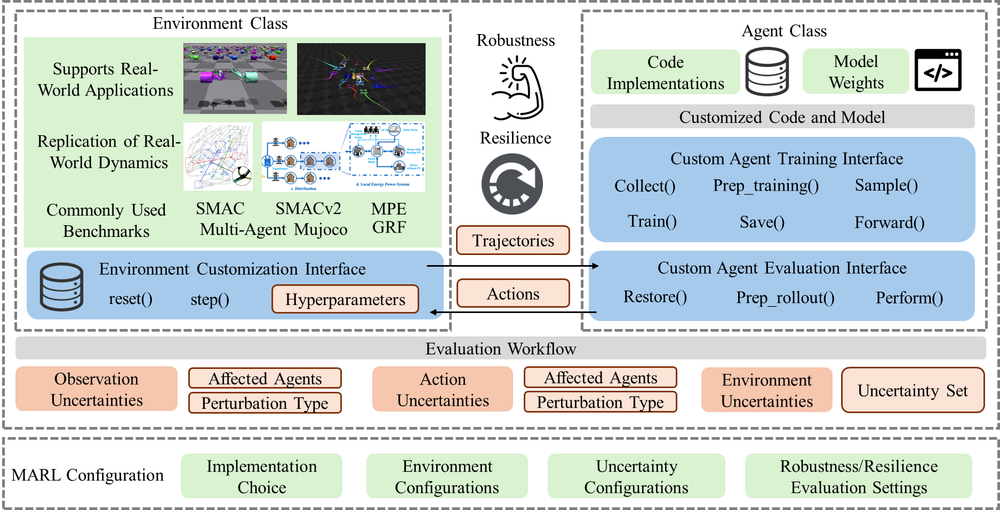

The general execution process is as follows:

1. Configure the default settings for each `<env, scenario, algo>` experiment group in the `settings` directory, with one JSON file for each algorithm.
2. Configure the parameters and value enumerations for batch experiments in the `tricks.json` file. Each experiment will vary only one parameter value based on the default settings.
3. Use `generate.py` to generate batch training execution commands.
4. Use `parallel.py` to execute the training commands in parallel.
5. After training is complete, use `generate.py` to generate batch evaluation execution commands for the trained models.
6. After evaluation is complete, use `export.py` to export the raw experimental data.
7. After data export is complete, call `plot.py` to generate batch plots.
8. Perform manual analysis of the experimental results.

### `amb` folder

The `amb` folder defines the experiment configurations, including the environments, scenarios, and algorithms used, as well as the implementation of the agent.

```plaintext
.
├── agents # Defines the base class for agents and some common agent implementations
│   ├── base_agent.py
│   ├── coma_agent.py
│   ├── ddpg_agent.py
│   ├── ppo_agent.py
│   └── q_agent.py
├── algorithms # Defines the base class for algorithms and some common algorithm implementations
│   ├── __init__.py
│   ├── happo.py
├── configs # Defines the configurations for algorithms and environments
│   ├── algos_cfgs
│   └── envs_cfgs
├── data # Defines the storage for data, using buffer to store data during the experiment
│   └── episode_buffer.py
├── envs # Implementation of external environments
│   ├── __init__.py
│   ├── base_logger.py
│   ├── env_example.py
├── models # Defines the base class for models and some common model implementations
│   ├── actor
│   ├── base  # Basic network types, such as CNN
│   ├── critic
│   └── mixer
├── runners # Runners and learners
│   ├── __init__.py
│   ├── dual
│   ├── dual_traitor
│   ├── evaluate # Evaluator
│   ├── perturbation # Perturbation attack
│   ├── single  # Single algorithm training
│   └── traitor # Insider attack
└── utils # Defined utilities
    ├── config_utils.py
    ├── env_utils.py
    ├── model_utils.py
    ├── popart.py
    └── trans_utils.py
```

### `experiment` folder

In the `experiment` directory of the project, there is a complete toolkit for running batch experiments. The directory structure is as follows. Please read the corresponding comments carefully:

```plaintext
├── out # Directory for storing generated files
│ ├── data # Directory for storing exported Excel experiment results
│ ├── figures # Directory for storing plot images
│ ├── logs # Directory for storing batch experiment logs
│ └── scripts # Directory for storing scripts for intermediate batch execution
├── results # Directory where TensorBoard records generated by experiments are stored
│ ├── dexhands
│ ├── network
│ ├── quads
│ └── voltage
├── settings # Directory for parameter configuration
│ ├── dexhands # Default configurations for each <env, scenario, algo> experiment group
│ ├── network
│ ├── quads
│ ├── voltage
│ ├── scheme.json # Used to determine which scheme a trick belongs to when plotting
│ └── tricks.json # Records the value enumerations of each hyperparameter for each algorithm, used for generating batch commands
├── utils # Utility package
│ ├── analysis
│ ├── epsilon
│ ├── plot # Tools used for plotting
│ └── path.py
├── export.py # Export experiment data from results to data
├── generate.py # Generate batch execution scripts
├── parallel.py # Execute statements in scripts in parallel
├── pipeline.py # Pipeline for serial execution of generate, train, eval, export, plot, rsync
├── plot.py # Used for plotting
├── README.md # Instructions for use
└── rsync.py # Tool for pushing experiment data to remote using rsync
```

### Detailed Instructions for Each Tool

#### `generate.py`

- **Usage**: Used to generate the corresponding commands, including both the train phase and the eval phase.

  ```bash
  python generate.py [-h] [-e ENV] [-s SCENARIO] [-a ALGO] [--stage {0,1,2}] [-o OUT] [--slice] [--config_path CONFIG_PATH] [--trick_config_path TRICK_CONFIG_PATH] [-t TRICK] [-m METHOD] [-g GPU] [--log_dir LOG_DIR] [-n NUM_WORKERS] [--extra EXTRA] {train,eval}
  ```

- **Positional Arguments**:

  - `{train,eval}`: Mode for generating training or evaluation scripts.

- **Optional Arguments**:

  - `-h, --help`: Show help message and exit.
  - `-e ENV, --env ENV`: Environment name.
  - `-s SCENARIO, --scenario SCENARIO`: Scenario or map name.
  - `-a ALGO, --algo ALGO`: Algorithm name.
  - `--stage {0,1,2}`: Stage for evaluation (0: Evaluate all; 1: Evaluate default model in adaptive_action and traitor; 2: Load adversarial model for evaluation).
  - `-o OUT, --out OUT`: Output directory.
  - `--slice`: Enable slicing evaluation.
  - `--config_path CONFIG_PATH`: Path to the default configuration file.
  - `--trick_config_path TRICK_CONFIG_PATH`: Path to the trick configuration file.
  - `-t TRICK, --trick TRICK`: Generate scripts for a specific trick.
  - `-m METHOD, --method METHOD`: Generate scripts for a specific attack method.
  - `-g GPU, --gpu GPU`: Specify the GPU number.
  - `--log_dir LOG_DIR`: Directory for results.
  - `-n NUM_WORKERS, --num_workers NUM_WORKERS`: Number of workers for parallel execution.
  - `--extra EXTRA`: Additional parameters (e.g., `--headless` for DexHands).

- **Example**:

  ```bash
  python generate.py -e dexhands -s ShadowHandPushBlock -a maddpg --extra="--headless"
  ```

#### `parallel.py`

- **Usage**: Used for parallel execution of commands, with the ability to specify the number of parallel processes.

  ```bash
  python parallel.py [-h] -s SCRIPT [-n NUM_WORKERS] [-o OUT]
  ```

- **Optional Arguments**:

  - `-h, --help`: Show help message and exit.
  - `-s SCRIPT, --script SCRIPT`: Bash file containing commands to execute.
  - `-n NUM_WORKERS, --num_workers NUM_WORKERS`: Number of workers for parallel execution.
  - `-o OUT, --out OUT`: Output directory.

#### `export.py`

- **Usage**: Exporting experimental data from TensorBoard.

  ```bash
  python export.py [-h] [-e ENV] [-s SCENARIO] [-a ALGO] [-o OUT] [--result_path RESULT_PATH] [--trick_cfg TRICK_CFG] [--attack ATTACK]
  ```

- **Optional Arguments**:

  - `-h, --help`: Show help message and exit.
  - `-e ENV, --env ENV`: Environment name.
  - `-s SCENARIO, --scenario SCENARIO`: Scenario or map name.
  - `-a ALGO, --algo ALGO`: Algorithm name.
  - `-o OUT, --out OUT`: Output directory.
  - `--result_path RESULT_PATH`: Path to the results directory.
  - `--trick_cfg TRICK_CFG`: Trick configuration file.
  - `--attack ATTACK`: List of attack methods to export.

#### `plot.py`

- **Usage**: Used to visualize experimental data as images for analysis.

  ```bash
  python plot.py [-h] [-e ENV] [-s SCENARIO] [-a ALGO] [-o OUT] [-f FILE] [-i {en,zh}] [-t {png,pdf}] [--result_path RESULT_PATH] [-g {trick,scheme}] [--show]
  ```

- **Optional Arguments**:

  - `-h, --help`: Show help message and exit.
  - `-e ENV, --env ENV`: Environment name.
  - `-s SCENARIO, --scenario SCENARIO`: Scenario or map name.
  - `-a ALGO, --algo ALGO`: Algorithm name.
  - `-o OUT, --out OUT`: Output directory.
  - `-f FILE, --file FILE`: Path to the Excel file.
  - `-i {en,zh}, --i18n {en,zh}`: Language for the plot (English or Chinese).
  - `-t {png,pdf}, --type {png,pdf}`: File type for saving the plot.
  - `--result_path RESULT_PATH`: Path to the results directory.
  - `-g {trick,scheme}, --groupby {trick,scheme}`: Group by trick or scheme.
  - `--show`: Display the plot.

## Features

### Comprehensive Evaluation Pipelines

- **Single-agent MARL Training**: Supports training of single-agent MARL algorithms in various environments.
- **Perturbation-based Attacks**: Evaluates robustness against observation and action perturbations using adversarial attacks.
- **Adversarial Traitors**: Tests resilience by introducing adversarial agents (traitors) that disrupt the cooperative behavior of the system.
- **Dual-agent MARL Training**: Allows training of two MARL algorithms simultaneously, with one acting as an adversary.
- **Traitors in Dual MARL**: Evaluates the impact of adversarial agents in dual-agent settings.

### Diverse Algorithms and Environments

- **Algorithms**:
  - **MAPPO**: Multi-Agent Proximal Policy Optimization, a state-of-the-art algorithm for cooperative MARL.
  - **MADDPG**: Multi-Agent Deep Deterministic Policy Gradient, suitable for continuous action spaces.
  - **QMIX**: Q-value-based Mixing for MARL, designed for value-based methods.
  - **HAPPO**: Heterogeneous-Agent Proximal Policy Optimization, optimized for heterogeneous agent settings.
- **Environments**:
  - **SMAC**: StarCraft II Micro-AI Challenge, focusing on decentralized micro-management scenarios.
  - **SMACv2**: An updated version of SMAC with randomized starting positions, unit types, and modified sight/attack ranges.
  - **Multi-Agent MuJoCo**: A multi-agent robotic control environment based on MuJoCo.
  - **PettingZoo MPE**: Multi-Particle Environment for communication-oriented tasks.
  - **Google Research Football**: A 3D football simulator for cooperative tasks.
  - **Gym**: A general-purpose RL library with various standard test environments.
  - **Custom Environments**: Support for integrating custom environments through a modular interface.

### Robustness and Resilience Evaluation

- **13 Distinct Uncertainties**: Evaluates robustness and resilience under various uncertainties, including:
  - **Observation Noise**: Gaussian noise, worst-case attacks, and learned optimal attacks.
  - **Action Perturbations**: Random policies, greedy worst-case policies, and learned optimal policies.
  - **Environmental Unpredictability**: Changes in environment dynamics (e.g., mass, velocity).
- **Real-world Applications**: Tests algorithms in environments that simulate real-world scenarios, such as dexterous hand manipulation, quadrotor swarm control, intelligent traffic control, and active voltage control.

### Modular and Extensible Design

- **Environment Interface**: Supports real-world applications, data-driven environments, and benchmark environments.
- **Agent Class**: Abstracts all functionalities required for MARL agents, enabling seamless integration of custom implementations and model weights.
- **Evaluation Workflow**: Automates the generation of shell commands for large-scale evaluations, streamlining the experimentation process.

### Comprehensive Data Set

- **82,620+ Experiments**: The data set includes results from over 82,620 experiments across four real-world environments, 13 uncertainty types, and 15 implementation choices.
- **Diverse Tasks**: Covers 19 tasks in total, including dexterous hand manipulation, quadrotor swarm control, intelligent traffic control, and active voltage control.
- **Algorithms and Uncertainties**: Evaluates the performance of MAPPO, MADDPG, and HAPPO under various uncertainties.
- **Implementation Choices**: Analyzes the impact of 15 implementation choices, such as network size, discount factor, activation function, etc.

### User-friendly Tools

- **Installation Scripts**: Simplifies the setup process with Conda environment creation and environment-specific dependency installation.
- **Batch Experiment Tools**: Supports large-scale empirical studies with tools for generating, executing, and analyzing experiments.
- **Customization**: Allows users to easily integrate custom algorithms, environments, and uncertainties through a modular interface.

## Installation

### Create Conda Environment

```bash
conda env create -f amb.yml
```

### Environment-Specific Dependencies

#### StarCraftII (SMAC and SMACv2)

```bash
wget https://blzdistsc2-a.akamaihd.net/Linux/SC2.4.10.zip
unzip -P iagreetotheeula SC2.4.10.zip
rm -rf SC2.4.10.zip

cd StarCraftII/
wget https://raw.githubusercontent.com/Blizzard/s2client-proto/master/stableid.json
```

Add the following to `~/.bashrc`:

```bash
export SC2PATH="/path/to/your/StarCraftII"
```

Copy the `amb/envs/smac/SMAC_Maps` and `amb/envs/smacv2/SMAC_Maps` directories to `StarCraftII/Maps`.

#### MAMuJoCo

```bash
pip install gymnasium_robotics supersuit
```

#### Google Research Football

Install required dependencies (Linux only):

```bash
sudo apt-get install git cmake build-essential libgl1-mesa-dev libsdl2-dev \
libsdl2-image-dev libsdl2-ttf-dev libsdl2-gfx-dev libboost-all-dev \
libdirectfb-dev libst-dev mesa-utils xvfb x11vnc python3-pip
```

Install GRF through pip:

```bash
pip install gfootball
```

#### Bi-Dexhands

1. Install IsaacGym as per [official guide](https://developer.nvidia.com/isaac-gym).
2. Fix bugs by referring to [this issue](https://forums.developer.nvidia.com/t/attributeerror-module-numpy-has-no-attribute-float/270702).
3. Install Vulkan:

```bash
wget -qO- https://packages.lunarg.com/lunarg-signing-key-pub.asc | sudo tee /etc/apt/trusted.gpg.d/lunarg.asc
sudo wget -qO /etc/apt/sources.list.d/lunarg-vulkan-1.3.275-jammy.list https://packages.lunarg.com/vulkan/1.3.275/lunarg-vulkan-1.3.275-jammy.list
sudo apt update
sudo apt install vulkan-sdk
```

#### Network System Dependencies

```bash
pip install eclipse-sumo sumolib traci seaborn ipdb
```

#### Voltage Control Dependencies

```bash
pip install pandapower
```

#### MetaDrive Dependencies

```bash
pip install metadrive-simulator
```

## Data Set

The data set includes results from over 82,620 experiments across four real-world environments, 13 uncertainty types, and 15 implementation choices. The data set is organized as follows:

- **Environments**: Dexterous Hand Manipulation, Quadrotor Swarm Control, Intelligent Traffic Control, Active Voltage Control
- **Tasks**: 19 tasks in total, covering a variety of real-world applications
- **Algorithms**: MAPPO, MADDPG, HAPPO
- **Uncertainties**: 13 types of uncertainties, including observation, action, and environmental uncertainties
- **Implementation Choices**: 15 choices, such as network size, discount factor, activation function, etc.

For more details on the data set, please refer to the README file of the data set.

## Attack Algorithms

You can refer to our paper for more details on the attack algorithms.

Attack algorithms are divided into three main categories:

- Observation Uncertainty Attacks
- Action Uncertainty Attacks
- Environment Uncertainty Attacks

The correspondence with the paper is as follows:

| Attack Algorithm Key | Description in the Paper                                     |
| -------------------- | ------------------------------------------------------------ |
| `random_noise`       | Observation uncertainty: Gaussian noise applied to all agents (Gaussian-single). |
| `random_noise_all`| Observation uncertainty: Gaussian noise applied to a single agent (Gaussian-all). |
| `pert_obs_sin`       | Observation uncertainty: Greedy worst-case attacks applied to a single agent (Greedy-single). |
| `pert_obs_all`       | Observation uncertainty: Greedy worst-case attacks applied to all agents (Greedy-all). |
| `learn_obs_sin`      | Observation uncertainty: Optimal learned attacks applied to a single agent (Optimal-single). |
| `learn_obs_all`      | Observation uncertainty: Optimal learned attacks applied to all agents (Optimal-all). |
| `env_random`         | Environment uncertainty: Randomized environment parameters affecting all agents (Env-random). |
| `random_policy`      | Action uncertainty: Random policies applied to a single agent (Random-single). |
| `random_policy_all`  | Action uncertainty: Random policies applied to all agents (Random-all). |
| `pert_act`           | Action uncertainty: Greedy worst-case policies applied to a single agent (Greedy-single). |
| `pert_act_all`       | Action uncertainty: Greedy worst-case policies applied to all agents (Greedy-all). |
| `learn_act`          | Action uncertainty: Optimal learned policies applied to a single agent (Optimal-single). |
| `learn_act_all`      | Action uncertainty: Optimal learned policies applied to all agents (Optimal-all). |

### Observation Uncertainty Attacks

1. **Gaussian Noise**
   - Description: Adds Gaussian noise to observations.
   - Variants:
     - **Gaussian-all**: Applies small perturbations to all agents.
     - **Gaussian-single**: Applies a larger perturbation to a single agent.
2. **Greedy Worst-Case Attacks**
   - Description: Uses gradient-based methods (e.g., PGD) to generate perturbations that maximize the KL divergence between the original and perturbed policies.
   - Variants:
     - **Greedy-all**: Targets all agents with a small perturbation budget.
     - **Greedy-single**: Targets a single agent with a large perturbation budget.
3. **Optimal Learned Attacks**
   - Description: Trains adversarial policies using RL to generate long-term effective perturbations.
   - Variants:
     - **Optimal-all**: Targets all agents with a small perturbation budget.
     - **Optimal-single**: Targets a single agent with a large perturbation budget.

### Action Uncertainty Attacks

1. **Random Policies**
   - Description: Agents take random actions.
   - Variants:
     - **Random-all**: All agents take random actions with a small probability.
     - **Random-single**: A single agent takes random actions with a large probability.
2. **Greedy Worst-Case Policies**
   - Description: Policies are perturbed to take actions that minimize the Q-value or have the lowest probability.
   - Variants:
     - **Greedy-all**: All agents adopt greedy worst-case policies with a small probability.
     - **Greedy-single**: A single agent adopts a greedy worst-case policy with a large probability.
3. **Optimal Learned Policies**
   - Description: Trains adversarial policies using RL to generate long-term effective action perturbations.
   - Variants:
     - **Optimal-all**: All agents take learned worst-case policies with a small probability.
     - **Optimal-single**: A single agent takes a learned worst-case policy with a large probability.

### Environment Uncertainty

Environment uncertainty has been a critical area of research. Given the inevitable discrepancies between simulation environments and real-world conditions, addressing uncertainties in environmental dynamics is a long-standing challenge in RL and MARL. Specifically, we define uncertainty sets over key environment parameters such as velocity and mass to simulate potential environmental variations. The uncertainties we use are listed in Table below.

| **Environment**             | **Uncertain Set**              | **Range**       |
| :-------------------------- | :----------------------------- | :-------------- |
| **Quadrotor Swarm Control**     | quads_collision_hitbox_radius  | [1.5, 2.5]      |
|                             | quads_collision_falloff_radius | [0.7, 1.3]      |
|                             | quads_obst_density             | [-0.2, 0.2]     |
|                             | quads_obst_size                | [0.7, 1.3]      |
| **Active Voltage Control**      | pv_scale                       | [0.7, 1.3]      |
|                             | demand_scale                   | [0.7, 1.3]      |
|                             | v_upper                        | [0.705, 1.305]  |
|                             | v_lower                        | [0.65, 1.25]    |
| **Dexterous Hand Manipulation** | startPositionNoise             | [-0.005, 0.005] |
|                             | transition_scale               | [0.2, 0.8]      |
|                             | orientation_scale              | [-0.2, 0.4]     |
|                             | rotRewardScale                 | [0.7, 1.3]      |
| **Intelligent Traffic Control** | norm_wave                      | [0.7, 1.3]      |
|                             | norm_wait                      | [-1.2, -0.8]    |
|                             | init_density                   | [-0.3, 0.3]     |

## Environments

AMB supports a variety of environments to evaluate the robustness and resilience of MARL algorithms. These environments cover a wide range of real-world applications and scenarios, providing a comprehensive platform for benchmarking.

### SMAC

**Description**: SMAC is a collaborative multi-agent reinforcement learning environment based on Blizzard's StarCraft II RTS game. It provides a convenient interface for autonomous agents to interact with StarCraft II, obtain observations, and execute actions. Unlike PySC2, SMAC focuses on decentralized micro-management scenarios, where each game unit is controlled by a separate RL agent.

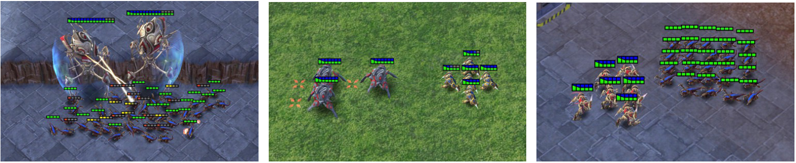

**Features**:

- **Environment**: Cooperative
- **Observability**: Partially observable
- **Action Space**: Discrete
- **Reward**: Dense/Sparse
- **Interaction Mode**: Simultaneous

**Installation**:

1. **Install StarCraft II**:

   ```bash
   wget https://blzdistsc2-a.akamaihd.net/Linux/sc2.4.10.zip
   unzip -P iagreetotheeula Sc2.4.10.zip
   rm -rf Sc2.4.10.zip
   cd StarCraftII/
   wget https://raw.githubusercontent.com/Blizzard/s2client-proto/master/stableid.json
   ```

   Add the following line to `~/.bashrc`:

   ```bash
   export SC2PATH="/path/to/your/StarCraftII"
   ```

   Copy the `amb/envs/smac/SMAC_Maps` directory to `StarCraftII/Maps`.

2. **Install SMAC**:

   ```bash
   pip install git+https://github.com/oxwhirl/smac.git
   ```

**Usage**:

- Modify the configuration in `amb/configs/env_cfgs/smac.yaml`:
- Train the model:

  ```bash
  python -u single_train.py --env smac --algo mappo --run single
  ```

**Official Link**: [oxwhirl/smac](https://github.com/oxwhirl/smac)

### SMACv2

**Description**: SMACv2 is an updated version of SMAC, focusing on non-centralized scenarios. It introduces three main changes compared to SMAC:

1. Randomized starting positions.
2. Randomized unit types.
3. Modified unit sight and attack ranges.

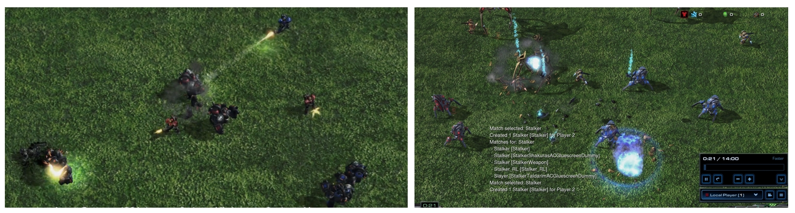

**Features**:

- **Environment**: Cooperative
- **Observability**: Partially observable
- **Action Space**: Discrete
- **Reward**: Dense/Sparse
- **Interaction Mode**: Simultaneous

**Installation**:

1. **Install StarCraft II** (same as SMAC):

   ```bash
   wget https://blzdistsc2-a.akamaihd.net/Linux/sc2.4.10.zip
   unzip -P iagreetotheeula Sc2.4.10.zip
   rm -rf Sc2.4.10.zip
   cd StarCraftII/
   wget https://raw.githubusercontent.com/Blizzard/s2client-proto/master/stableid.json
   ```

   Add the following line to `~/.bashrc`:

   ```bash
   export SC2PATH="/path/to/your/StarCraftII"
   ```

   Copy the `amb/envs/smacv2/SMAC_Maps` directory to `StarCraftII/Maps`.

2. **Install SMACv2**:

   ```bash
   pip install git+https://github.com/oxwhirl/smacv2.git
   ```

   If you need to extend SMACv2, use the following commands:

   ```bash
   git clone https://github.com/oxwhirl/smacv2.git
   cd smacv2
   pip install -e "[dev]"
   pre-commit install
   ```

**Usage**:

- Modify the configuration in `amb/configs/env_cfgs/smacv2.yaml`:
- Train the model:

  ```bash
  python -u single_train.py --env smacv2 --algo mappo --run single
  ```

**Official Link**: [oxwhirl/smacv2](https://github.com/oxwhirl/smacv2)

### Multi-Agent MuJoCo

**Description**: Multi-Agent MuJoCo (MAMujoco) is a multi-agent robotic control environment based on the popular single-agent robotic control platform MuJoCo. It provides various task scenarios, including humanoid robots, snake robots, quadruped robots, and more. Multiple agents belonging to the same robot need to collaborate to complete the tasks.

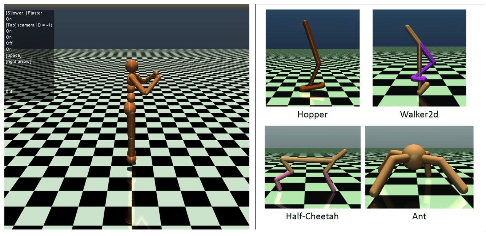

**Features**:

- **Environment**: Cooperative/Collaborative
- **Observability**: Partially observable
- **Action Space**: Continuous
- **Reward**: Dense
- **Interaction Mode**: Simultaneous

**Installation**:

1. **Install MuJoCo**:

   ```bash
   pip install mujoco
   ```

2. **Install gymnasium-robotics**:

   ```bash
   pip install gymnasium-robotics==1.2.3
   ```

**Usage**:

- Modify the configuration in `amb/configs/env_cfgs/mamujoco.yaml`:
- Train the model:

  ```bash
  python -u single_train.py --env mamujoco --algo mappo --run single
  ```

**Official Link**: [google-deepmind/mujoco](https://github.com/google-deepmind/mujoco)

### PettingZoo MPE

**Description**: PettingZoo MPE (Multi-Particle Environment) is a communication-oriented environment where agents can move, communicate, observe each other, and interact with fixed landmarks. It features continuous observation and discrete action spaces with basic physical simulations.

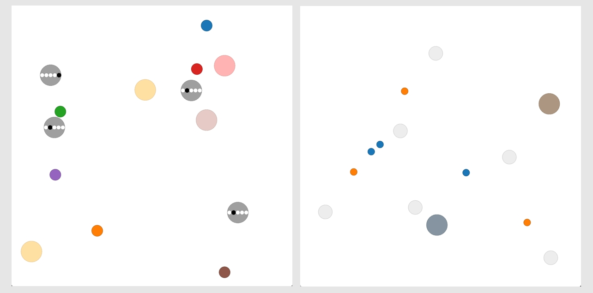

**Features**:

- **Environment**: Cooperative/Collaborative/Competitive/Mixed
- **Observability**: Fully observable
- **Action Space**: Discrete + Continuous
- **Reward**: Dense
- **Interaction Mode**: Simultaneous/Asynchronous

**Installation**:

```bash
pip install pettingzoo==1.24.1
pip install supersuit==3.9.8
```

**Usage**:

- Modify the configuration in `amb/configs/env_cfgs/pettingzoo_mpe.yaml`:
- Train the model:

  ```bash
  python -u single_train.py --env pettingzoo_mpe --algo mappo --run single
  ```

**Official Link**: [openai/multiagent-particle-envs](https://github.com/openai/multiagent-particle-envs)

### Google Research Football

**Description**: Google Research Football is an RL environment based on the open-source game Gameplay Football. Agents are trained to play football in a 3D simulator with realistic physics.

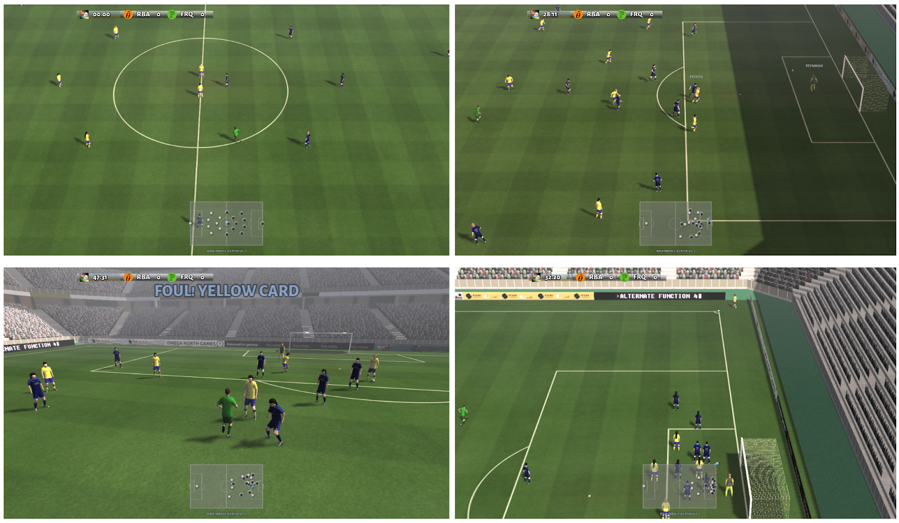

**Features**:

- **Environment**: Cooperative/Collaborative
- **Observability**: Fully observable
- **Action Space**: Discrete
- **Reward**: Sparse
- **Interaction Mode**: Simultaneous

**Installation**:

1. **Install system dependencies**:

   ```bash
   sudo apt-get install git cmake build-essential libgl1-mesa-dev libsdl2-dev libsdl2-image-dev libsdl2-ttf-dev libsdl2-gfx-dev libboost-all-dev libdirectfb-dev libst-dev mesa-utils xvfb x11vnc python3-pip
   ```

2. **Install Google Research Football**:

   ```bash
   pip install gfootball
   ```

**Usage**:

- Modify the configuration in `amb/configs/env_cfgs/football.yaml`:
- Train the model:

  ```bash
  python -u single_train.py --env football --algo mappo --run single
  ```

**Official Link**: [google-research/football](https://github.com/google-research/football)

### Gym

**Description**: Gym is a general-purpose reinforcement learning library developed by OpenAI. It integrates various standard test environments, allowing researchers and developers to train agents under the same conditions and compare their algorithms.

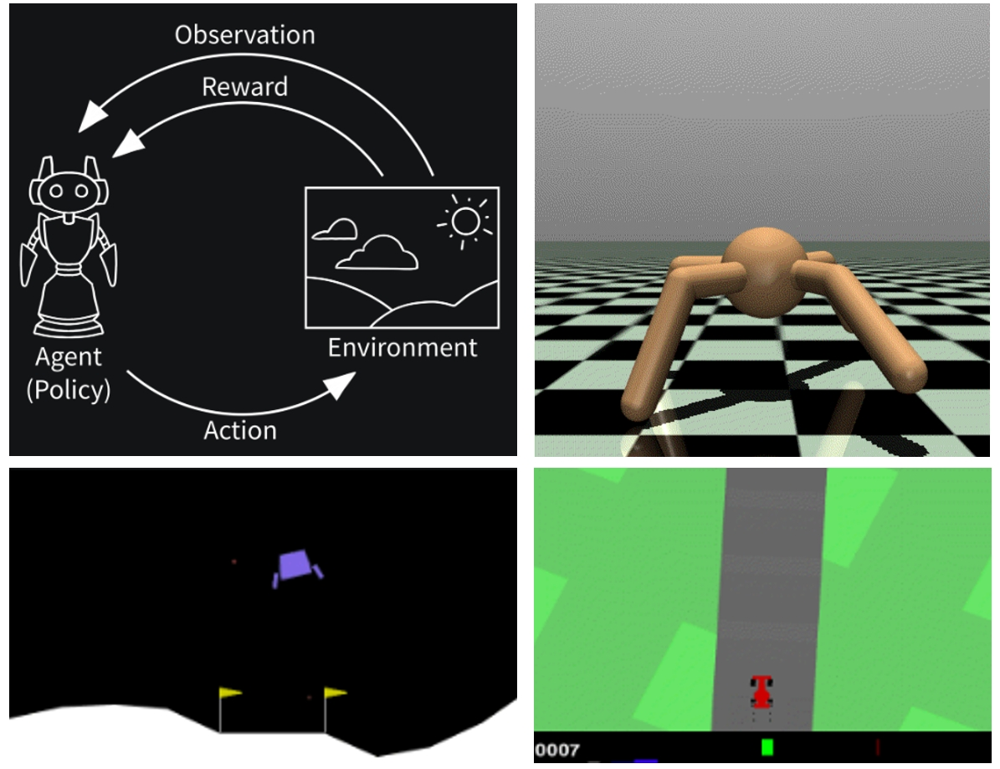

**Features**:

- **Environment**: Cooperative/Collaborative/Competitive
- **Observability**: Fully observable/Partially observable
- **Action Space**: Discrete/Continuous
- **Reward**: Dense/Sparse
- **Interaction Mode**: Simultaneous

**Installation**:

```bash
pip install gym
```

**Usage**:

- Modify the configuration in `amb/configs/env_cfgs/gym.yaml`:
- Train the model:

  ```bash
  python -u single_train.py --env gym --algo mappo --run single
  ```

**Official Link**: [gym](https://gymnasium.farama.org/)

### Bi-DexHands

**Description**: The Bimanual Dexterous Hand Manipulation environment (DexHand) is a comprehensive simulation platform designed to mimic human dexterity through reinforcement learning. Using two anatomically realistic Shadow Hands, each with 24 degrees of freedom (DoF), it tackles tasks ranging from basic object manipulation to advanced bimanual coordination like stacking, catching, and reorientation. These tasks are designed to match different levels of human motor skills according to cognitive science literature, and demand precise control, adaptability, and synchronized multi-agent cooperation. Powered by the Isaac Gym simulator, Bi-DexHands combines physical realism with challenging, multi-agent tasks, presenting a high level of difficulty for learning and mastering these tasks.

In this work, six typical tasks are considered for the deployment of all the MARL algorithms and attacks in our benchmark. These tasks include: *PushBlock*, *SwingCup*, *Re-Orientation*, *BlockStack*, *HandCatchUnderarm*, and *HandCatchOver2Underarm*. Below, we provide a brief description of these 6 tasks. For more details, we direct readers to the official project page of Bi-DexHands https://github.com/PKU-MARL/DexterousHands.

- **PushBlock**: This task requires both hands to touch the block and push it forward.
- **SwingCup**: This task requires two hands to hold the cup handle and rotate it 90 degrees.
- **Re-Orientation**: This task involves two hands and two objects. Each hand holds an object and we need to reorient the object to the target orientation.
- **BlockStack**: This task involves dual hands and two blocks, and we need to stack the block as a tower.
- **HandCatchUnderarm**: In this problem, two shadow hands with palms facing upwards are controlled to pass an object from one palm to the other. What makes it more difficult is that the hands' translation and rotation degrees of freedom are not frozen but are added into the action space.
- **HandCatchOver2Underarm**: In this task, the object needs to be thrown from the vertical hand to the palm-up hand.

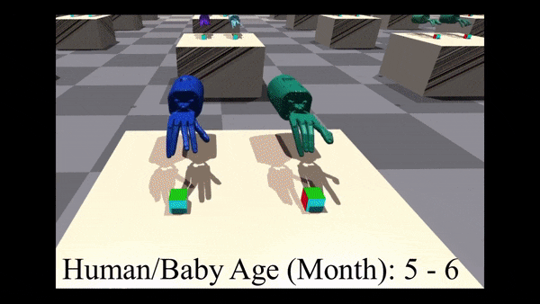

**Features**:

- **Environment**: Cooperative
- **Observability**: Partially observable
- **Action Space**: Continuous
- **Reward**: Dense
- **Interaction Mode**: Simultaneous

**Installation**:

1. **Install IsaacGym**:

   ```bash
   cd isaacgym/python
   pip install -e .
   ```

2. **Install Vulkan SDK**:

   ```bash
   wget -qO- https://packages.lunarg.com/lunarg-signing-key-pub.asc | sudo tee /etc/apt/trusted.gpg.d/lunarg.asc
   sudo wget -qO /etc/apt/sources.list.d/lunarg-vulkan-1.3.275-jammy.list https://packages.lunarg.com/vulkan/1.3.275/lunarg-vulkan-1.3.275-jammy.list
   sudo apt update
   sudo apt install vulkan-sdk
   ```

**Usage**:

- Modify the configuration in `amb/configs/env_cfgs/dexhands.yaml`:
- Train the model:

  ```bash
  python -u single_train.py --env dexhands --algo mappo --run single
  ```

**Official Link**: [PKU-MARL/DexterousHands](https://github.com/PKU-MARL/DexterousHands)

### Quadrotor Swarms

**Description**: The Quadrotor Swarm Control (Quad) environment is designed to train RL policies for controlling quadrotor swarms. In this environment, each quadrotor is controlled by an individual RL agent, enabling the development of sophisticated swarm behaviors. These include performing tight maneuvers in formation, avoiding collisions, adapting to dynamic obstacles, and collaborating in pursuit-evasion tasks. The environment simulates realistic quadrotor flight physics, accurately capturing the complex dynamics of aerial movement and multi-agent interactions. This ensures that the policies learned within the simulator can be generalized to real-world systems.

The environment includes several key scenarios to assess the quadrotors' abilities in different contexts. These tasks focus on the control, coordination, and safety of the swarm under various challenging conditions. Our benchmark experiments consist of six tasks: *static_diff_goal*, *static_same_goal*, *o_static_same_goal*, *o_random*, *o_swap_goals*, and *swarm_vs_swarm*, where *o_* denotes environments with a moving obstacle. A more detailed description of these six tasks is provided below, and additional information can be found on the official project page at https://sites.google.com/view/swarm-rl.

- **static_diff_goal**: In this task, quadrotors are trained to fly in close formation while maintaining a cohesive structure and avoiding collisions. The target formation, which remains fixed throughout the episode, can take various geometric shapes (e.g., 2D grid, circle, cylinder, and cube). The separation r between goals within the formation is randomly chosen.
- **static_same_goal**: This is a special case of the *static_diff_goal* scenario, where the separation between goals is zero (r=0). In this case, the goal locations for all quadrotors coincide, creating a dense formation with a high probability of collisions. This task requires enhanced coordination and decentralized control to ensure safe flight compared to the *static_diff_goal* task.
- **o_static_same_goal**: This task is similar to the *static_same_goal* task but takes place in an environment with dense cylindrical obstacles. The quadrotors must maintain their formation while avoiding collisions with the obstacles.
- **o_random**: In this task, each quadrotor's position in the formation is randomly sampled within the environment, which contains dense cylindrical obstacles. Every quadrotor needs to reach its own target position as fast as possible.
- **o_swap_goals**: This is a kind of dynamic formation control task. Given a predefined formation, the target positions of the quadrotors are randomly swapped multiple times during the episode. Additionally, the quadrotors must avoid collision with the dense obstacles in the environment.
- **swarm_vs_swarm**: In this task, the swarm is split into two groups, then the target formations of quadrotors in these two groups are swapped several times per episode, which requires two teams of quadrotors to fly through each other while avoiding head-on collisions at high speed.
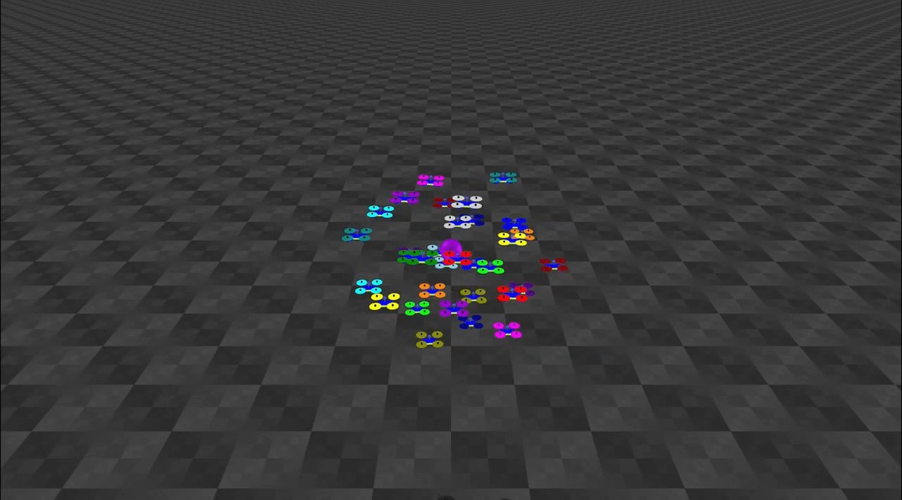

**Features**:

- **Environment**: Cooperative
- **Observability**: Partially observable
- **Action Space**: Continuous
- **Reward**: Dense
- **Interaction Mode**: Simultaneous

**Installation**:

The Quadrotor Swarms environment is integrated into the source code and does not require additional installation.

**Usage**:

- Modify the configuration in `amb/configs/env_cfgs/quads.yaml`:
- Train the model:

  ```bash
  python -u single_train.py --env quads --algo mappo --run single
  ```

**Official Link**: [Zhehui-Huang/quad-swarm-rl](https://github.com/Zhehui-Huang/quad-swarm-rl)

### Network System Control

**Description**: The Intelligent Traffic Control (Traffic) environment focuses on training MARL agents to manage networked traffic systems. It supports various real-world traffic tasks, including Adaptive Traffic Signal Control (ATSC) and Cooperative Adaptive Cruise Control (CACC). In this environment, each agent represents either a traffic signal or a vehicle. Agents adjust their policies based on local observations and messages from neighboring agents, aiming to optimize overall traffic flow and safety. For ATSC tasks, agents control traffic signals at intersections, dynamically adjusting green/red light timings in response to local traffic conditions (e.g., vehicle density, wait times) and messages from adjacent intersections. In CACC tasks, agents simulate cooperative vehicle control, adjusting their speeds to either follow or close the gap with a leading vehicle, ensuring smooth, coordinated traffic flow.

This environment is capable of simulating both synthetic and real-world traffic networks, offering challenging scenarios for traffic signal and cooperative vehicle control tasks. Its versatility makes it an ideal platform for capturing the complexities of real-world traffic systems, such as partial observability, non-stationary dynamics, and decentralized control. In our benchmark, we evaluate performance across four tasks within this environment: *ATSC Grid*, *ATSC Monaco*, *CACC Catch-up*, and *CACC Slow-down*. A detailed description of these tasks can be found on the official project page https://github.com/cts198859/deeprl_network.

- **ATSC Grid**: This task simulates traffic signal control within a synthetic 5×5 grid-based traffic network. Each intersection in the grid is controlled by an agent, which adjusts its signal timings based on local traffic conditions (e.g., vehicle density, wait times) and messages from neighboring agents. The task aims to optimize traffic flow and reduce congestion in this synthetic environment.
- **ATSC Monaco**: This task models adaptive traffic signal control in a real-world 28-intersection network, specifically based on the traffic system of Monaco city. Agents control traffic signals in this dynamic environment, addressing complex traffic patterns and interactions between intersections. The learned policies must effectively manage these complexities, focusing on reducing congestion, enhancing traffic throughput, and ensuring safe driving conditions. However, this task requires agents to have heterogeneous observation and action spaces. We thus omit this in our evaluation.
- **CACC Catch-up**: In this task, agents simulate CACC systems in a network of 8 vehicles. The goal is for each vehicle to follow and "catch up" with a leading vehicle by adjusting its speed based on the relative position and velocity of the vehicle ahead. This task emphasizes the importance of coordination between agents to maintain efficient vehicle spacing and flow.
- **CACC Slow-down**: This task simulates a CACC system in which 7 agents follow a leading vehicle and slow down appropriately. Agents adjust their speeds based on the behavior of the leading vehicle, ensuring safe distances while reducing speed when necessary. This scenario highlights the challenges of safely managing the traffic flow in situations where deceleration is required.

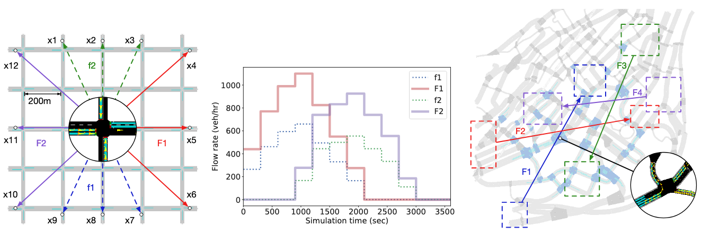

**Features**:

- **Environment**: Cooperative
- **Observability**: Partially observable
- **Action Space**: Discrete
- **Reward**: Dense
- **Interaction Mode**: Simultaneous

**Installation**:

```bash
pip install eclipse-sumo sumolib traci seaborn ipdb
```

**Usage**:

- Modify the configuration in `amb/configs/env_cfgs/network.yaml`:
- Train the model:

  ```bash
  python -u single_train.py --env network --algo mappo --run single
  ```

**Official Link**: [cts198859/deeprl_network](https://github.com/cts198859/deeprl_network)

### Voltage Control

**Description**: The Active Voltage Control (Voltage) environment provides a simulation platform for training RL policies to manage voltage in power distribution networks. It specifically targets the challenges posed by the integration of distributed energy resources, such as rooftop photovoltaics (PVs), into power grids, where excess power generation can cause voltage fluctuations. These fluctuations may exceed acceptable grid limits.

The primary objective of the Voltage environment is to mitigate these voltage fluctuations by controlling the reactive power generated by PV inverters. Each agent in the system corresponds to a PV inverter, which adjusts the reactive power to regulate the voltage at its respective bus. However, since the voltage at each bus is influenced by the power at all other buses, and not all buses are equipped with PV inverters, agents must collaborate to ensure that the voltage across the entire network remains within a safe range. Given that each agent has limited visibility and can only observe the state of the local zone, the problem is naturally framed as a Decentralized Partially Observable Markov Decision Process (Dec-POMDP), requiring coordinated decision-making under uncertain conditions.

The Voltage environment includes three distinct scenarios based on real public data, each with different scales, ranging from small systems with 6 agents to larger systems with 38 agents. These scenarios vary in complexity, and our benchmark tests the robustness and scalability of multiple MARL algorithms across all three. The scenarios are referred to as the *33-Bus System*, *141-Bus System*, and *322-Bus System*. A brief overview of each follows:

- **33-Bus System**: This scenario models a small-scale distribution network with 6 PV agents, which cooperate to regulate the voltage across 32 loads distributed over 4 regions. The challenge is to maintain voltage within a safe range while minimizing power loss in a system with relatively fewer agents and simpler interactions.
- **141-Bus System**: This scenario involves a medium-scale distribution network with 22 PV agents that must coordinate to control voltage across 84 loads in 9 regions. The agents must manage more complex interactions and larger variations in power generation, requiring advanced coordination strategies.
- **322-Bus System**: This scenario simulates a large-scale distribution network with 38 agents controlling voltage across 337 loads in 22 regions. This complex environment emphasizes scalability and robustness, as agents must manage a larger network with greater uncertainty. Coordinating actions efficiently to maintain voltage stability is critical, despite the challenges posed by a large number of loads and agents, along with more dynamic power fluctuations. This scenario tests the performance and adaptability of MARL algorithms in large-scale control tasks.

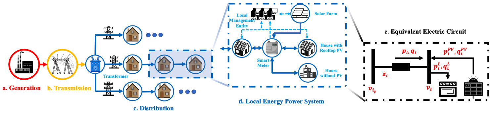

**Features**:

- **Environment**: Cooperative
- **Observability**: Partially observable
- **Action Space**: Discrete
- **Reward**: Dense
- **Interaction Mode**: Simultaneous

**Installation**:

```bash
pip install pandapower
```

**Usage**:

- First, make sure you have voltage data downloaded to `amb/envs/voltage/data/`, which can be found at [this link](https://drive.google.com/file/d/17MG8SMztQp0pJ-cSXyX0SOegJAPPNIQJ/view?usp=sharing)
- Modify the configuration in `amb/configs/env_cfgs/voltage.yaml`:
- Train the model:

  ```bash
  python -u single_train.py --env voltage --algo mappo --run single
  ```

**Official Link**: [Future-Power-Networks/MAPDN](https://github.com/Future-Power-Networks/MAPDN)

## Custom Environments and Agents

### Custom Environments

#### How to Implement a New Custom Environment

To implement a new custom environment, you can either modify the environment itself or wrap an existing environment to conform to the AMB interface.

1. **Modify the Environment**:
   - Directly edit the environment code to align with AMB's interface requirements.
2. **Use a Wrapper**:
   - Create a wrapper around an existing environment to adapt it to AMB's interface.

**Steps**:

1. **Modify `amb/utils/env_utils.py`**:

   - Add your custom environment information to the `make_train_env`, `make_eval_env`, and `make_render_env` functions. For example:

     ```python
     if env_name == "custom_env":
         env = CustomEnv(**env_args)
     ```

2. **Modify `amb/utils/config_utils.py`**:

   - Add your custom environment's task name to the `get_task_name` function. For example:

     ```python
     if env_name == "custom_env":
         return "custom_task_name"
     ```

#### Custom Environment Interface Introduction

- **Configuration Files**:
  - All environment configuration parameters should be written in `amb/configs/env_cfgs/{environment_name}.yaml`. These parameters will be read as a dictionary and passed to the environment via the `env_args` argument in the `make_xxx_env` functions.
- **Interface Requirements**:
  - Your environment class must implement all the interfaces defined in `amb/envs/env_example.py`, including input and output type restrictions and requirements.
- **Logger for Dual Environments**:
  - If the environment is used for Dual training (adversarial training), you need to implement a dedicated logger to record key information during the training process.

### Custom Agents

#### How to Implement a New Custom Agent

To implement a new custom agent, you can follow these steps:

1. **Use Predefined Networks**:
   - Utilize the predefined network structures in `/amb/models` as a starting point. You can either extend these networks or define new ones as needed.
2. **Modify Existing Agents**:
   - The `/amb/agents` directory already includes implementations of various agents such as `coma_agent`, `ddpg_agent`, `ppo_agent`, and `q_agent`. You can modify these agents or create new ones based on your requirements.
3. **Update Algorithm Files**:
   - Modify the `/amb/algorithms/{algorithm_name}.py` file to integrate your custom agent. Specify the agent you want to use in the algorithm configuration.

#### Custom Agent Interface Introduction

- **Configuration Files**:
  - All agent configuration parameters should be written in `amb/configs/algo_cfgs/{algorithm_name}.yaml`. These parameters will be read as a dictionary.
- **Interface Requirements**:
  - Your agent class must implement all the interfaces defined in `amb/agents/base_agent.py`, including input and output type restrictions and requirements.

## Contributing

We welcome contributions from the community to enhance the framework. To contribute, please follow these steps:

1. Fork the repository.
2. Create a new branch for your feature or bug fix.
3. Make your changes and ensure they adhere to the existing code style.
4. Submit a pull request with a clear description of your changes.
